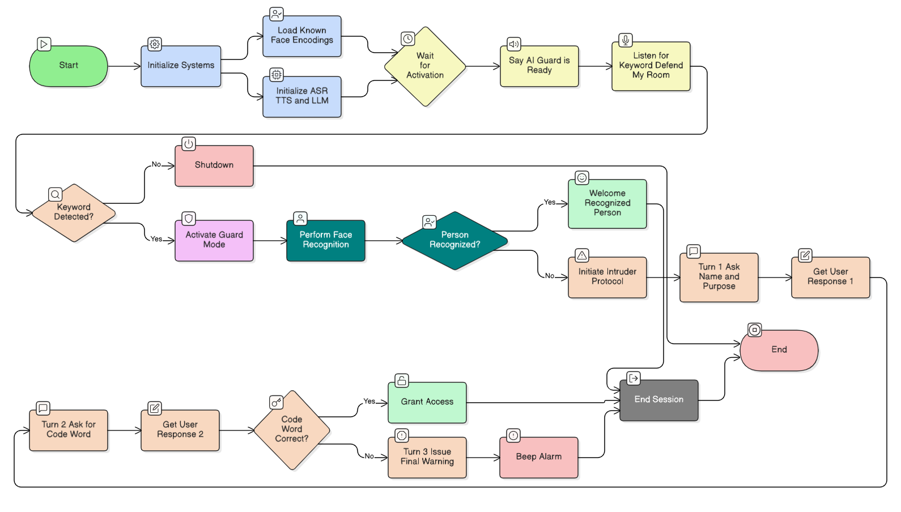

**EE782:** **Advanced** **Topics** **in** **Machine** **Learning**

**Programming** **Assignment** **2:** **AI** **Guard** **Agent**
**System** **Report**

**Group** **Members:** Souradeep Dutta \[25M2571\], Matam Kushaal
\[23B1290\]

**Demo:** [**Agentic** **AI** **System**
**.mp4**](https://drive.google.com/file/d/1VHqsQjj_TpJRf2L9JEyUD40s4RnqVwQY/view?usp=sharing)

**1.** **System** **Architecture**

Our AI Guard Agent is designed as a modular system that integrates
several pre-trained AI models to create a cohesive security monitoring
solution. The architecture is built around a central orchestrator script
that manages the state of the agent and coordinates the flow of
information between the different modules.

The core components are:

> ● **Activation** **Module** **(ASR):** The system remains in a passive
> listening state until a specific keyword phrase ("defend my room") is
> detected. We use the SpeechRecognition library, which leverages
> Google's Web Speech API for accurate command recognition. It listens
> in short windows to minimize resource usage while waiting for the
> activation command.
>
> ● **Vision** **Module** **(Face** **Recognition):** Once activated,
> the system engages the webcam using OpenCV. The face_recognition
> library is used to perform real-time face detection and
> identification. To enroll trusted individuals, the system pre-loads
> face encodings from a local dataset of images. For performance, video
> frames are resized, and processing is done on every 15th frame. To
> ensure robust identification and prevent flickering, a person's
> identity is only confirmed after several consecutive, consistent
> detections.
>
> ● **Dialogue** **Module** **(LLM,** **ASR,** **TTS):** If an
> unrecognized individual is detected, the Dialogue Module is triggered.
> This module manages the escalating interaction protocol.
>
> ○ **LLM** **(Large** **Language** **Model):** We use the Groq API with
> the Llama 3 model to generate conversational prompts. The LLM is
> guided by a system policy that defines the three levels of escalation,
> ensuring responses are firm, concise, and appropriate for the context.
>
> ○ **TTS** **(Text-to-Speech):** The agent's responses, generated by
> the LLM, are vocalized using the pyttsx3 library. This provides a
> natural, spoken interaction with the potential intruder. To prevent
> audio conflicts, the TTS engine runs in a separate thread.
>
> ○ **ASR** **(Automatic** **Speech** **Recognition):** The SpeechASR
> class is used again here to capture and transcribe the responses from
> the unrecognized individual, which are then processed to determine the
> next step in the protocol.
>
> ● **Core** **Orchestrator** **(run_ai_guard_system):** This is the
> main control loop that dictates the agent's behavior. It initializes
> all modules, waits for the activation command, triggers the face
> recognition process, and, based on the outcome, either welcomes a
> trusted user or initiates the handle_intruder

> protocol.
>
> **Fig.** **1.** **<u>System Architecture</u>**

**2.** **Integration** **Challenges** **and** **Solutions**

Integrating multiple real-time AI systems presented several challenges:

> ● **Challenge** **1:** **Real-time** **Performance** **and**
> **Resource** **Management**
>
> ○ **Problem:** Continuously running face recognition on a
> high-resolution video stream is computationally expensive and can lead
> to high CPU usage and system lag.
>
> ○ **Solution:** We implemented two optimizations. First, we resize
> each frame to 25% of its original size (frame_resizing = 0.25) before
> processing. Second, the face detection logic is executed only once
> every 15 frames. This significantly reduces the computational load
> without noticeably compromising the agent's ability to detect a person
> in front of the camera.
>
> ● **Challenge** **2:** **Robust** **and** **Stable** **Face**
> **Identification**
>
> ○ **Problem:** In real-world conditions, lighting changes or head
> movements can cause face recognition models to "flicker" between a
> correct identification and "Unknown," leading to false alarms.
>
> ○ **Solution:** We implemented a confirmation mechanism using a deque
> (a fixed-size queue) to store the last five detections. A person's
> identity is only considered "confirmed" if their name appears in at
> least four of these five recent detections. This temporal smoothing
> ensures the system is confident in its identification before taking
> action.
>
> ● **Challenge** **3:** **Audio** **I/O** **Conflicts**
>
> ○ **Problem:** Using both speech recognition (microphone input) and
> text-to-speech (speaker output) simultaneously can lead to driver
> conflicts or cause the main application to freeze while the TTS engine
> is speaking.
>
> ○ **Solution:** Our TTSVoice class is designed to run the pyttsx3
> engine in a separate thread. This non-blocking approach allows the
> main application loop to remain responsive. The say_and_listen
> function explicitly waits for the TTS thread to complete (block=True)
> before activating the microphone, ensuring the agent doesn't try to
> listen to its own voice.

**3.** **Ethical** **Considerations**

> ● **Consent** **and** **Privacy:** The foremost ethical consideration
> is privacy. The system was designed to be activated only by an
> explicit voice command, ensuring it is not "always listening" or
> "always watching." For enrollment, consent was obtained from all
> trusted individuals before using their photographs to generate face
> encodings.
>
> ● **Data** **Security:** All facial encoding data is stored locally in
> a project folder. No biometric data is transmitted over the internet
> or stored in a cloud database, minimizing the risk of data breaches.
>
> ● **Potential** **for** **Misidentification:** There is a non-zero
> risk of both false negatives (failing to recognize a trusted person)
> and false positives (incorrectly identifying an intruder as a trusted
> person). The stable detection logic was implemented to mitigate this,
> but the risk cannot be eliminated. In a real-world scenario, this
> system should be used as a deterrent, not as a replacement for a
> proper security system.
>
> ● **Escalation** **and** **Confrontation:** The conversational
> escalation is designed to be a non-violent deterrent. However,
> engaging with an intruder, even through an AI, could provoke an
> unpredictable response. The system's final action is a stern warning
> and an audible alarm, avoiding any language that could be interpreted
> as a physical threat.

**4.** **Instructions** **to** **Run** **the** **Code**

> 1\. **Prerequisites:** ○ Python 3.8+
>
> ○ A working microphone and webcam.
>
> ○ For Windows, dlib and cmake may need to be installed separately
> before installing face_recognition.
>
> 2\. **Dependencies:** Install the required Python libraries using pip:
>
> pip install opencv-python face_recognition SpeechRecognition pyaudio
> pyttsx3 groq
>
> 3\. **Setup:**
>
> ○ **Create** **Dataset:** Create a folder (e.g., dataset) in the
> project directory. Inside this folder, create sub-folders with the
> names of trusted individuals. Place several clear photos of each
> person in their respective folder.
>
> ○ **API** **Key:** Obtain a free API key from the Groq Console. Set
> this key as an environment variable named GROQ_API_KEY.
>
> ○ **Update** **Code:** In the main script, ensure the DATASET_PATH
> variable points to the folder you created in the first step.
>
> 4\. **Execution:**
>
> ○ Run the main Python script from your terminal. ○ The agent will say,
> "AI guard is ready."
>
> ○ To activate the guard, clearly say the phrase: **"defend** **my**
> **room"**.
>
> ○ The webcam will turn on. If a trusted person is recognized, they
> will be welcomed. If not, the intruder protocol will begin.
